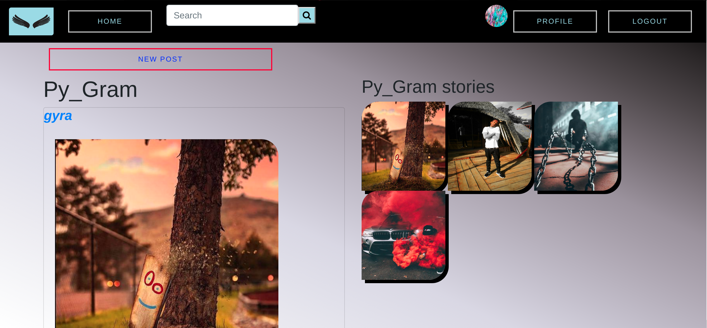

# [Py_Gram]()

This project was generated with [Django](https://www.djangoproject.com) version 2.2.8 <br>



To view the site Click [Py_Gram]()

## Author: 
  * [Peter Mirithu](https://github.com/petermirithu/py_gram)

#### Authors' information
*Peter Mirithu*
    Email: pyra_m.k@yahoo.com <br>
    Address: 1394 <br>
    Software Developer.<br>
    Telephone N.O: 0790476167          
## Description
  

## Specifications
  * Behaviours
  ```
  
  ```

## Setup Requirements
  Here's a brief introduction on what a developer must do in order to start running the app locally:

  ```
  $ git clone https://github.com/petermirithu/py_gram
  $ cd py_gram/
  ```
  * create a virtual environment
  * Activate the virtual environment
  * create your own database
  * add configurations for the database in the project settings file
  
  ```
  $ pip install -r requirements.txt
  $ chmod a+x start.sh
  $ ./start.sh
  ```
  <hr>
  To run tests:

  ```
  $ python3.6 manage.py test py_gram
  ```
  <hr>
     
## Technologies Used
  This project was generated with
  * [Python](https://www.python.org/) version 3.8.0. 
  * [Django](https://www.djangoproject.com/) version 2.2.8
  * Bootstrap4.
  * Javascript.
  * CSS3
  * PSQL database.  

 ## Support and contact details
  Incase of a problem, issue or need more clarification, feel free to send an email<br> @ pyra_m.k@yahoo.com<br>
  Contact Pyra at : 0790476167

 ### License
* This project is licensed by [MIT License](LICENSE.txt)<br>
  Copyright (c) [Peter Mirithu](https://github.com/petermirithu/py_gram) 2019<br>
  
  


